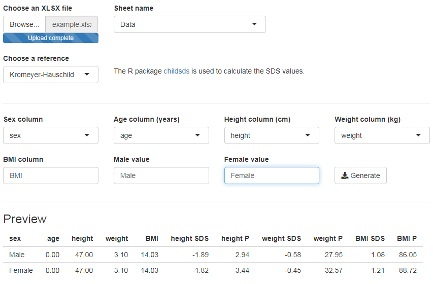

# sds-calculator

The interactive Shiny app enables users to upload Excel (xlsx) files with height and weight annd calculate SDS values.
Users have to possibility to configure the input and select appropriate reference values.

A live demo is available at <https://christophb.shinyapps.io/sds-calculator>.
